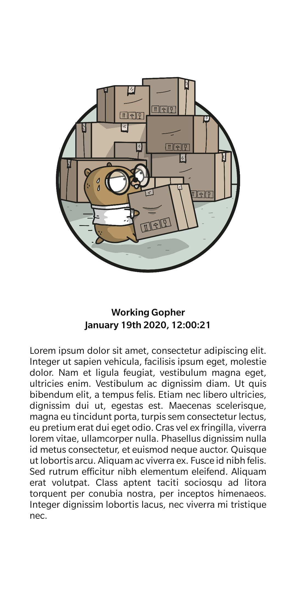
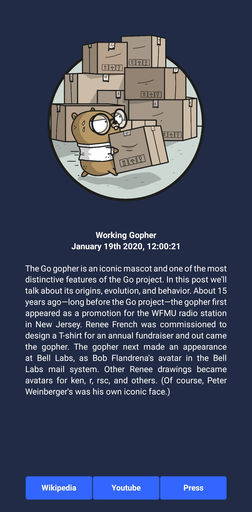

# Workshop 1 React Native

Dans ce permier workshop nous allons apprendre à utiliser React Native en réalisant un application basique utilisant l'api de SpaceX.

- [Workshop 1 React Native](#workshop-1-react-native)
  - [Mise en place](#mise-en-place)
      - [Installer NodeJS et npm](#installer-nodejs-et-npm)
      - [Installer expo](#installer-expo)
      - [Création du projet](#cr%c3%a9ation-du-projet)
  - [Fondamentaux de React Native](#fondamentaux-de-react-native)
      - [JSX](#jsx)
      - [Components](#components)
      - [Props](#props)
      - [Style](#style)
  - [Exercice 1](#exercice-1)
  - [Librairie UI Kitten](#librairie-ui-kitten)
  - [Exercice 2:](#exercice-2)
  - [Utiliser l'API de SpaceX](#utiliser-lapi-de-spacex)
      - [Les states](#les-states)
      - [Axios](#axios)
  - [Exercice 3](#exercice-3)


---
## Mise en place

#### Installer NodeJS et npm
Pour vérifier si vous avez déjà nodejs et npm sur votre ordinateur, tapez les commandes suivantes dans votre terminal.
```shell
node -v
npm -v
```
Si l'une des deux commandes ne fonctionne pas, [suivez ces instructions](https://nodejs.org/en/download/package-manager/).

#### Installer expo
Expo est un outils construit autour de React Native et des plateformes natives qui aide au developement, build et deploiement des applications.  
Expo a donc une interface cli et une interface mobile permettant un rendu de l'application en temps réeal avec un hot reload.

Tapez cette commande dans votre termial pour installer expo-cli
```bash
npm install -g expo-cli
```

Installer l'application Expo sur votre smartphone [Android](https://play.google.com/store/apps/details?id=host.exp.exponent) ou [iOS](https://itunes.com/apps/exponent)

#### Création du projet
Pour créer le projet tapez cette commande dans votre terninal dans le dossier ou vous voulez que votre projet soit créer. Cette commande va créer un dossier `SpaceXApp` avec la configuration de base du projet.
```bash
expo init SpaceXApp
```

Choisisez la template `minimal`
```bash
❯ expo init SpaceXApp
? Choose a template:
  ----- Managed workflow -----
  blank                 a minimal app as clean as an empty canvas
  blank (TypeScript)    same as blank but with TypeScript configuration
  tabs                  several example screens and tabs using react-navigation
  ----- Bare workflow -----
❯ minimal               bare and minimal, just the essentials to get you started

  minimal (TypeScript)  same as minimal but with TypeScript configuration
```

Remplisez les informations dans le json
```bash
? Please enter names for your project. › 100% completed
 {
   "name": "SpaceXApp",
   "displayName": "SpaceXApp"
 }
```

L'installation du projet devrait commencer.  
Une fois fini, déplacez vous dans le dossier du projet et lancez le.
```bash
cd SpaceXApp
expo start
```

Ouvrez l'application mobile Expo et utilisez la fonction `Scan QR Code` pour scanner le QR code affiché dans votre terminal.  
L'application devrait se lancer sur votre l'écran de votre smartphone avec un `Welcome to React Native`.


---
## Fondamentaux de React Native

:exclamation: Pour les explications qui vont suivre, je vous conseil d'essayer et de modifier les examples dans votre application mobile pour bien les comprendre.

#### JSX
Le JSX est une syntaxe pour écrire du XML dans du Javascript.
```XML
<View>
    <Text>Hello world!</Text>
</View>
```
Le JSX resemble à du HTML mais à la place d'utiliser des balises comme `<div>` ou `<p>` on utilise des components React.  
`<Text>` est un component built-in qui afficher du texte  
`<View>` est un component qui se comporte comme `<div>` ou `<span>`


#### Components

Un component React est un objet qui afficher quelque chose. Chaques éléments affiché est donc un component.  
Pour définir un nouveau component, il suffit juste de faire hériter une class de la class `Component`. Un component React __doit__ avoir la methode `render` qui renvoie du code JSX à rendre.

```javascript
import React, { Component } from 'react';
import { Text, View } from 'react-native';

export default class HelloWorld extends Component {   // héritage de la class Component
  render() {                                             // methode render
    return (                                             // return du code JSX
      <View>
        <Text>Hello, world!</Text>
      </View>
    );
  }
}
```


#### Props

Une prop est simplement une propriété. Un component peut être customisé en lui passant une prop en paramètre à la création.

```javascript
import React, { Component } from 'react';
import { Image } from 'react-native';

export default class Gopher extends Component {
  render() {
    return (
      <Image source={{uri: "https://pbs.twimg.com/media/DfdsaI5XkAA6uPc?format=jpg&name=medium"}} style={{width: 500, height: 500}}/>
    );
  }
}
```
On peut voir ici que le component prend en paramètre la prop `source` qui permet de spécifier le lien vers l'image a afficher.

Vos components peuvent aussi recevoir des props.

```javascript
import React, { Component } from 'react';
import { Text, View } from 'react-native';

class Greeting extends Component {
  render() {
    return (
      <View>
        <Text>Hello {this.props.name}!</Text>
      </View>
    );
  }
}

export default class GophersGreetings extends Component {
  render() {
    return (
      <View>
        <Greeting name='Blue Gopher' />
        <Greeting name='Pink Gopher' />
        <Greeting name='Yellow Gopher' />
      </View>
    );
  }
}
```
Ici on a créé un component `Greeting` utilisant une prop `name`. Pour Utiliser ce component il suffit donc de passer la prop `name` en paramètre au component à la création dans le JSX: `<Greeting name='Gopher' />`.  
Ce component est donc modifiable et réutilisable pour saluer n'importe qui !


#### Style

Tous les components de base de React Native acceptent une prop `style`. Les données passé à cette prop sont l'équivalent du CSS à l'exception des noms qui sont écrits en camelCase plutôt qu'en snake-case.  
Le style d'un component peut être écrit de deux manière différentes : 

__inline__  
```XML
<Text style={{color: 'red'}}>Gopher!</Text>
```
Le style est simplement passé au component par par prop `style` entre deux brackets.

__plain old js object__
```javascript
import React, { Component } from 'react';
import { StyleSheet, Text, View } from 'react-native';

export default class Style extends Component {
  render() {
    return (
      <View>
        <Text style={styles.redText}>Gopher</Text>
        <Text style={styles.editedText}>Gopher</Text>
        <Text style={[styles.editedText, styles.redText]}>Gopher</Text>
      </View>
    );
  }
}

const styles = StyleSheet.create({
  redText: {
    color: 'red',
  },
  editedText: {
    color: 'green',
    fontWeight: 'bold',
    fontSize: 30,
  }
});
```
Le style est déclaré en dehors du component en tant qu'objet javascript qui peut être appellé en paramètre de la prop `style`. Il est possible de combiner plusieurs objets de style dans un seul paramètre en utilisant un tableau. Si plusieurs règles de style rentrent en conflit, seul la dernière mentioné est utilisé.

Pour la mise en page de votre application, plusieurs règles de style peuvent être utilisé. Je vous renvoie vers la documentation officiel très complette : 
[Height and Width](https://facebook.github.io/react-native/docs/height-and-width) et
[Layout with Flexbox](https://facebook.github.io/react-native/docs/flexbox)


---
## Exercice 1

Utilisez ces nouvelles conaissances pour réaliser une application affichant une image de votre choix, un titre, une date sous ce format : `2020-01-19T11:00:21.000Z` (ISO) et une description.  
Amusez vous et jouez avec les différents éléments pour mieux les assimiler.  
Essayer de rendre le tout le plus beaux possible !

__Example :__




Petit tips pour les notch :unamused:
```js
import { SafeAreaView, Platform, StyleSheet } from 'react-native';

export default class Safe extends Component {
  render() {
    return (
      <SafeAreaView style={styles.droidSafeArea}>
        <!-- votre app -->
      </SafeAreaView>
    );
  }
}

const styles = StyleSheet.create({
  droidSafeArea: {
    flex: 1,
    paddingTop: Platform.OS === "android" ? 33 : 0,  // ajustez la valeur pour votre smartphone
  },
});
```
Pour les dates, vous pouvez regarder [moment js](https://momentjs.com/)

---
## Librairie UI Kitten


En React Native, une librairie de component permet de mettre à la disposition des dévelopeurs des outils qui lui font gagner du temps.  

UI Kitten est une librairie avec plus de 20 component UI et proposant un système de thème.  

Pour ajouter UI Kitten à votre projet, tapez cette commande à la racine de celui-ci :

```bash
npm i @ui-kitten/components @eva-design/eva react-native-svg
```

---
## Exercice 2:

- Référez vous à la [documentation des différents components de UI Kitten](https://akveo.github.io/react-native-ui-kitten/docs/components/components-overview) et modifier l'exercice 1 pour utiliser uniquement des composents de la librairie (excepté l'image).
- Utilisez le theme `dark` de UI Kitten.
- Ajoutez 3 boutons ouvrant des pages webs.

__Example :__



__Tips :__

L'équivalent de `<View>` dans UI Kitten est `<Layout>`.  
Regardez bien comment utiliser les flexbox pour la mise en page ([Layout with Flexbox](https://facebook.github.io/react-native/docs/flexbox)).  
Pour ouvrir un lien depuis votre application, vous pouvez utiliser :
```javascript
import {Linking} from 'react-native';

Linking.openURL('https://google.com')
```
Référez vous à la documentation de React Native pour gérer les actions sur les boutons: [Handling Touches](https://facebook.github.io/react-native/docs/handling-touches)

---
## Utiliser l'API de SpaceX

Pour finir ce workshop, on va utiliser l'[API de SpaceX](https://github.com/r-spacex/SpaceX-API) pour afficher les informations sur le dernier lancement. SpaceX met à disposition une documentation Postman nous permettant de tester les routes directement sur l'interface de ce dernier. Je vous conseil d'utiliser le [client postman](https://www.getpostman.com/downloads/) de votre système d'exploitation et de cliquer sur le bouton `Run in Postman` en haut a droite de la [documentation web](https://docs.spacexdata.com/?version=latest) pour avoir accès à la collection de requetes.

#### Les states

Contrairement à une prop qui est passé à la création et qui ne peux pas être modifié, un state peut être modifié n'importe quand à l'intérieur d'un component.  
Ils vont vous être nécécaisaire pour utiliser l'api de SpaceX dans votre application.  
Les states sont initialié dans le constructeur.
```javascript
class Gopher extends Component {
  constructor(props) {
    super(props);
    this.state = {
      myState: 0,
    };
  }
...
```
Ils doivent être modifié en utilisant `this.setState`
```javascript
this.setState({
  myState: 2,
})
```
Ils sont accessible comme un attribute classique
```javascript
console.log(this.state.myState)
```

#### Axios

Axios est une librairie pour faire des requettes HTTP.

Installation : 
```bash
npm install axios --save
```
Import :
```javascript
import axios from 'axios'
```

Je vous conseil d'utiliser cette librairie pour faire vos requettes HTTP car elle offre beaucoup de fonctionalités que nous ne verons pas aujourd'hui mais qui peuvent vous être utile plus tard.

Example simple de requette get sur l'API de SpaceX :
```javascript
axios.get(`https://api.spacexdata.com/v3/dragons`)
      .then(res => {
        console.log(res.data)
      })
```

---
## Exercice 3

Reprenez l'exercice 2 et ajouter l'appelle à l'API de SpaceX pour récupérer les informations sur le dernier lancement.
- Chercher la bonne route à appeller pour récupérer les informations sur le dernier lancement
- Afficher le patch de la mission
- Afficher le titre de la mission
- Afficher la date du lancement
- Afficher la description de la mission
- Redirigez vers la page wikipedia, youtube et press grâce aux boutons de l'exercice 2

__Example :__


__Tips :__

Utilisez la methode `componentDidMount`. Elle est appellé à chaques fois que le component est monté. C'est l'endroit idéal pour faire une requete à une API et récupérer des données. [documentation](https://reactjs.org/docs/react-component.html#componentdidmount)

---

Félicitation ! Vous pouvez passer au [workshop 2](../Workshop%202/README.md) pour aller plus loin !

